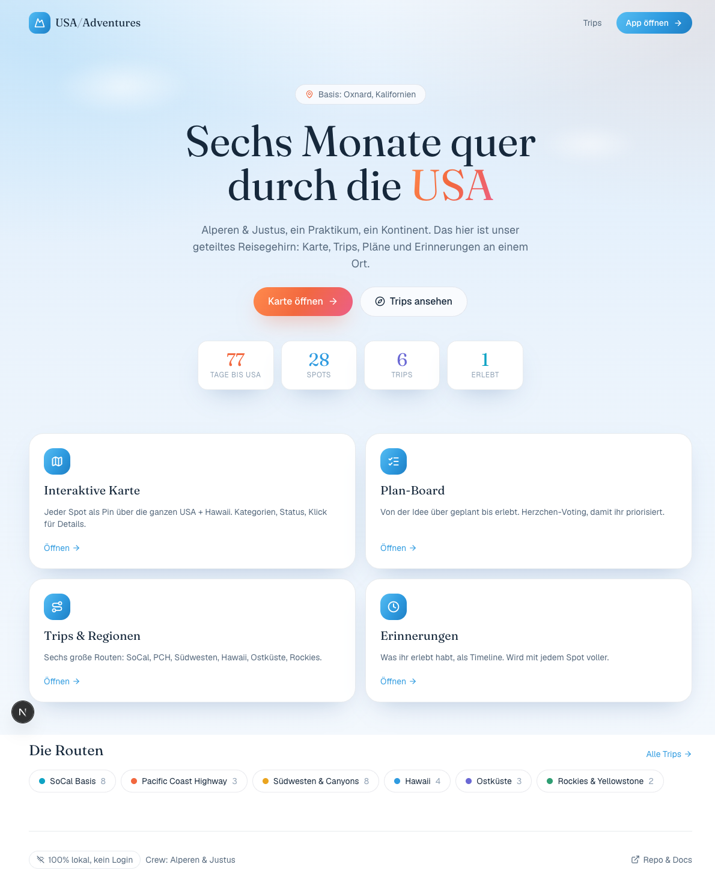
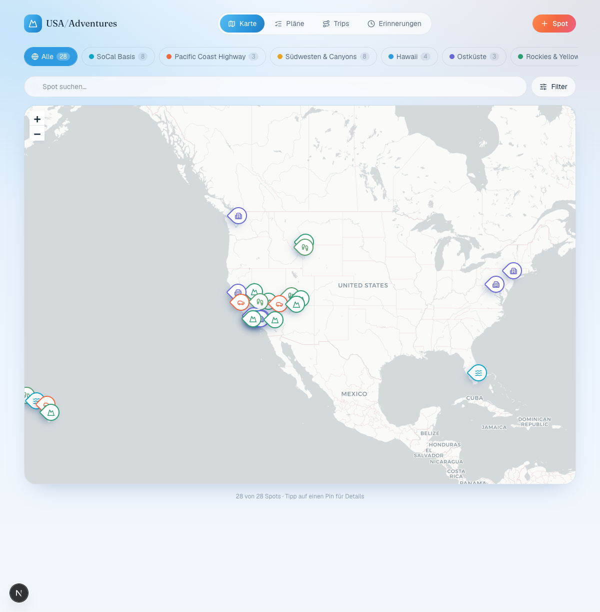

<div align="center">

<h1>USA / Adventures</h1>

<p><b>Sechs Monate quer durch die USA.</b> Eine lokale Reise-Web-App mit interaktiver Karte, Trips, Plan-Board und Erinnerungs-Timeline. Kein Login, keine Datenbank, keine Cloud &mdash; alle Daten leben im Projekt.</p>

<p>
  
  
  
  
  
  
  
</p>



</div>

---

## Was ist das?

Alperen &amp; Justus machen ein halbes Jahr Praktikum in Kalifornien. Diese App ist
ihr **geteiltes Reisegehirn**: Wo wollen wir hin, was ist geplant, was haben wir
schon erlebt &mdash; alles an einem Ort, hübsch und mobil.

Gebaut, um **gemeinsam per Vibe-Coding** weiterzuwachsen: klare Struktur, alle
Inhalte in zwei Dateien, und feste Regeln für KI-Agenten (Copilot &amp; Co).

<table>
<tr>
<td width="50%" valign="top">

### Features

- **Interaktive Karte** &mdash; alle Spots als Pins über die ganzen USA + Hawaii
- **Trips / Regionen** &mdash; SoCal, PCH, Südwesten, Hawaii, Ostküste, Rockies
- **Plan-Board** &mdash; Idee &rarr; geplant &rarr; erlebt, mit Herzchen-Voting
- **Erinnerungen** &mdash; Timeline von allem, was schon erlebt wurde
- **Filter &amp; Suche** &mdash; nach Kategorie, Status, Person, Text
- **Countdown** &mdash; Tage bis zum Abflug, Fortschritt der Rotation

</td>
<td width="50%" valign="top">

### Design-Entscheidungen

- **Nur Icons, keine Emojis.** Durchgängig `lucide-react`. Immer.
- **Airy-Sky-Look** &mdash; luftig, hell, Wolken-Ästhetik
- **Editorial Typo** &mdash; Fraunces (Display) + Geist (Text)
- **Mobile-first** &mdash; Bottom-Nav + FAB auf dem Handy
- **Framer-Motion** &mdash; alles bewegt sich sanft, nichts springt
- **100% lokal** &mdash; keine Secrets, kein Login, sofort deploybar

</td>
</tr>
</table>

<div align="center"></div>

---

## Schnellstart

```bash
npm install
npm run dev      # http://localhost:3000
```

Das war's. Keine Konfiguration, keine `.env`, keine Keys.

---

## Inhalte ändern (auch ohne Coding)

Alle Orte und Trips liegen in **zwei Dateien**. Nur die musst du anfassen:

| Datei            | Inhalt                     |
| ---------------- | -------------------------- |
| `data/places.ts` | Orte / Spots (Karten-Pins) |
| `data/trips.ts`  | Trips / Regionen           |

Kopiere eine Zeile, ändere die Werte, speichern &mdash; fertig. Schritt-für-Schritt:
[`docs/DATEN-BEARBEITEN.md`](docs/DATEN-BEARBEITEN.md).

---

## Projektstruktur

```
app/                 Routes (Next.js App Router)
  page.tsx           Landing (/)
  map/ plans/        /map, /plans
  trips/ memories/   /trips, /memories
  globals.css        Design-Tokens (Farben, Schatten)
components/          UI-Bausteine (handgeschrieben)
lib/
  types.ts           Datentypen
  config.ts          Reisedaten, Kategorien, Crew, Kartenzentrum
  store.tsx          Der eine Context: useApp() (lokal, localStorage)
  filter.ts          Filter-Logik
data/                >>> INHALTE: places.ts + trips.ts <<<
docs/                Anleitungen
```

---

## Tech-Stack

Next.js 16 (App Router) &middot; React 19 &middot; TypeScript (strict) &middot;
Tailwind CSS v4 &middot; lucide-react (Icons) &middot; framer-motion &middot;
react-leaflet + Leaflet &middot; date-fns. Formatierung mit Prettier, Linting mit
ESLint, pre-commit Hook via Husky. Keine Component-Library, kein Backend.

---

## Befehle

```bash
npm run dev          # lokal starten
npm run check        # typecheck + lint + prettier-check
npm run format       # Code formatieren
npm run build        # Produktions-Build
```

Beim Committen läuft automatisch ein **pre-commit Hook** (Husky): formatiert,
lintet mit Autofix und typecheckt. Schlägt etwas fehl, wird der Commit gestoppt.

---

## Deploy (Vercel)

Repo bei [vercel.com](https://vercel.com) importieren, **Deploy** klicken. Next.js
wird erkannt, **keine Environment-Variablen nötig**. Läuft.

---

## Für KI-Agenten (Vibe-Coding)

Dieses Repo wird mit KI-Agenten weiterentwickelt. Die verbindlichen Regeln stehen in:

- [`AGENTS.md`](AGENTS.md) &mdash; vollständige Regeln, Tech-Stack, Standards, Rezepte
- [`.github/copilot-instructions.md`](.github/copilot-instructions.md) &mdash; Kurzfassung für Copilot

**Kernregeln:** keine Emojis (nur Icons), kein Backend/keine Secrets, TypeScript
strict, State nur über `useApp()`, `npm run check` muss grün sein.

---

<div align="center"><sub>Crew: Alperen &amp; Justus &middot; Basis: Oxnard, Kalifornien</sub></div>
